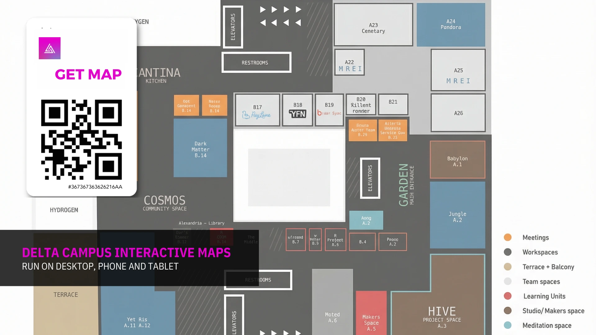
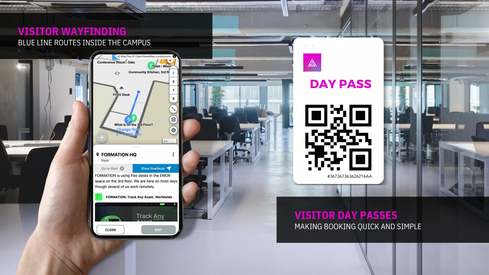
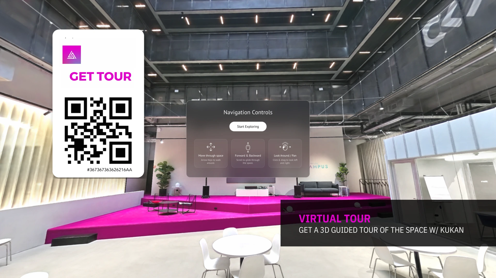
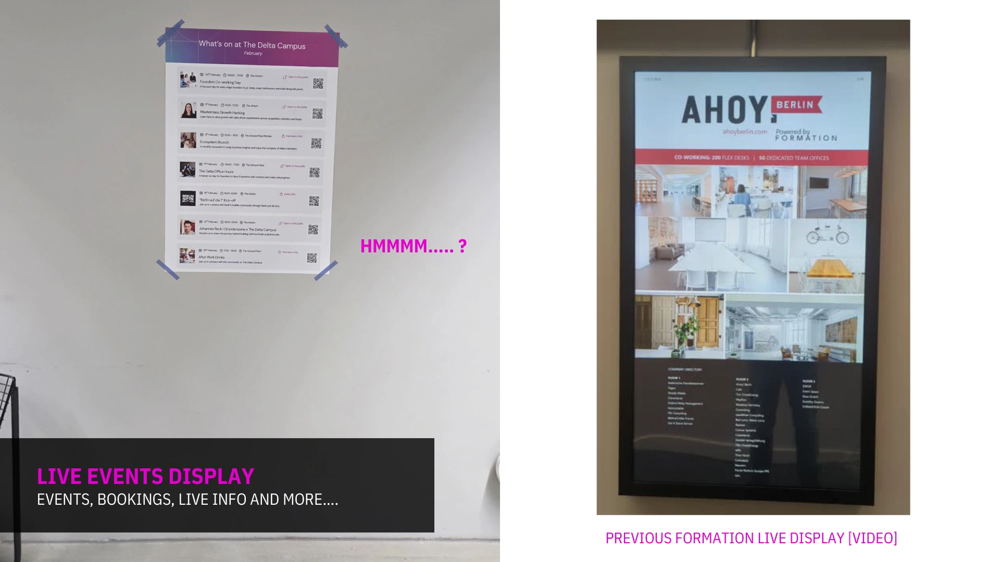
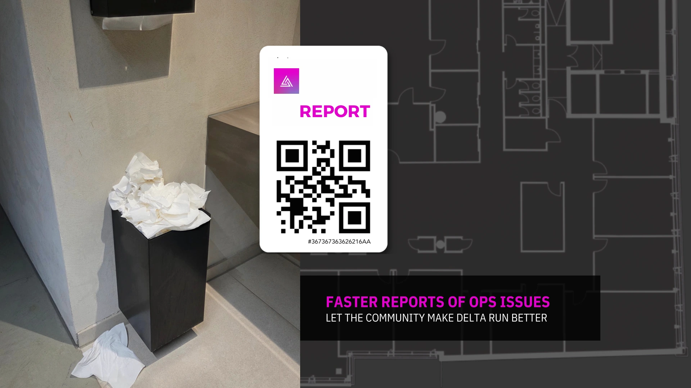
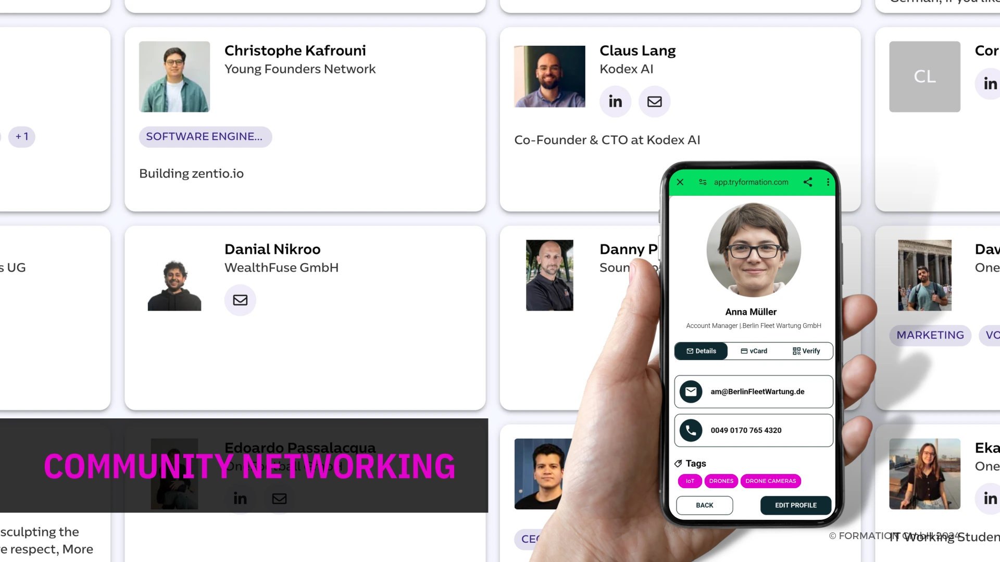
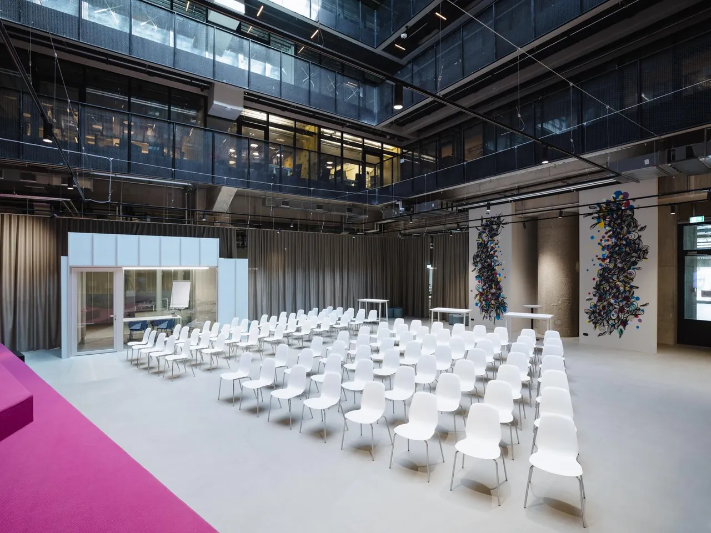

<!-- .slide: class="title-slide proposal-cover hero-video-slide" data-theme-background="cover" -->

<section class="cover-shell">
  

    
    
    
  

  
The Delta Advanced Visitor Experience

  

  
Delta Campus Angebot

  
Angebotsstrukturierte Fassung des bestehenden Delta-Campus-Konzeptmaterials

  

    In partnership with FORMATION
    |
    Interaktive Visitor Experience
    |
    Berlin
  

</section>

---
<!-- .slide: data-theme-background="intro" -->
## Was Das Delta-Campus-Material Bereits Enthaelt

Das Ausgangsmaterial ist keine generische Campus-Story. Es zeigt einen konkreten Konzept-Stack fuer Delta Campus: interaktive Karten, Visitor Wayfinding, Day Passes, Guided POIs, Virtual Tours, Screens, Room Booking, Event-Infos, operatives Reporting und Community Networking.

  

    
Visitor Layer

    <h3>Orientierung und Zugang</h3>
    <ul>
      <li>Interaktive Karten fuer Desktop, Phone und Tablet</li>
      <li>Stage-One-2.5D-Webinterface</li>
      <li>Blue-Line-Routen innerhalb des Campus</li>
      <li>Visitor Day Passes und einfache QR-basierte Zugangspunkte</li>
    </ul>
  

  

    
Campus Layer

    <h3>Information und Aktivierung</h3>
    <ul>
      <li>Guided POIs fuer die relevantesten Spaces und Services</li>
      <li>Live Events Display und Room-Booking-Konzepte</li>
      <li>Data Layer, Visitor Analytics und Operational Insight</li>
      <li>Partner Layer ueber Kukan Gaussian Splat Capture</li>
    </ul>
  

---
<!-- .slide: class="hero-video-slide platform-video-slide" data-theme-background="platform" -->
## Kernbausteine Des Angebots

Diese Angebotsvariante organisiert das bestehende Delta-Campus-Material neu, ohne den eigentlichen Inhalt umzudeuten.

  

    
Baustein 1

    <h3 class="minor-heading">Interaktive Campus-Karten</h3>
    
Kartenzugang auf mehreren Geraeten, getragen vom Stage-One-2.5D-Webinterface.

  

  

    
Baustein 2

    <h3 class="minor-heading">Navigation und Discovery</h3>
    
Blue-Line-Wayfinding, Day-Pass-Touchpoints, Guided POIs und klarere Wege zu relevanten Spaces.

  

  

    
Baustein 3

    <h3 class="minor-heading">Engagement und Operations</h3>
    
Screens, Room Booking, Event-Information, Reporting, Analytics und Community-Networking-Surfaces.

  

  

    Map Layer
    <strong>2.5D Interface</strong>
  

  

    Journey Layer
    <strong>Wayfinding + POIs</strong>
  

  

    Activation Layer
    <strong>Screens + Data + Community</strong>
  

---
<!-- .slide: data-theme-background="roadmap" -->
## Interaktive Karten Und Die Erste Interface-Schicht

Die Karte ist die erste Produktsurface. Das Material zeigt ein Delta-Campus-Map-System, das auf mehreren Geraeten laeuft und die Grundlage fuer Navigation und Interaktion bildet.

  

    
    
Interactive Maps

    <h3 class="minor-heading">Desktop, Phone und Tablet</h3>
    
Die Maps werden explizit als Multi-Device-Surface positioniert und nicht nur als einzelner Kiosk-Touchpoint.

  

  

    
    
Stage One

    <h3 class="minor-heading">2.5D-Webinterface</h3>
    
Die visitor-facing Webschicht ist bereits als erste Umsetzungsstufe des Campus-Erlebnisses markiert.

  

---
<!-- .slide: class="dark-corner-logo-slide" data-theme-background="packages-a" -->
## Wayfinding, Day Passes Und Guided POIs

Das Referenzmaterial verknuepft Navigation mit konkreten Campus-Interaktionen und nicht nur mit Kartendarstellung.

  

    
    
Wayfinding

    <h3 class="minor-heading">Blue-Line-Routen im Campus</h3>
    
Besucher erhalten Routenfuehrung innerhalb des Gebaeudes, wobei der Weg selbst Teil des Erlebnisses wird.

  

  

    
    
Discovery

    <h3 class="minor-heading">Guided POIs und Tours</h3>
    
Das System hebt die relevantesten Spaces und Services hervor und verlaengert sich in einen QR-basierten Virtual-Tour-Flow.

  

  

    Visitor Passes
    <strong>Quick and simple booking</strong>
    
Das Day-Pass-Konzept ist bereits als Teil der Visitor Journey gezeigt.

  

  

    POIs
    <strong>Relevant spaces only</strong>
    
Das Material kuratiert, was wichtig ist, statt jeden Raum gleich zu behandeln.

  

  

    Virtual Tour
    <strong>3D guided tour with Kukan</strong>
    
Das Tour-Konzept erweitert den Campus ueber flaches Browsing hinaus in echte raeumliche Exploration.

  

---
<!-- .slide: class="delta-video-slide delta-kukan-logo-slide" data-background-video="assets/delta-campus/delta_2k.mp4" data-background-video-loop="true" data-background-video-muted="true" data-background-size="cover" data-background-color="#050607" -->

---
<!-- .slide: data-theme-background="packages-b" -->
## Screens, Events Und Room Booking

Das Delta-Campus-Material umfasst auch physische Interfaces: Event-Information, Screen-Konzepte und Room-Booking-Surfaces.

<table class="proposal-table roadmap-table">
  <thead>
    <tr>
      <th>Surface</th>
      <th>Im Material sichtbar</th>
      <th>Rolle im Angebot</th>
    </tr>
  </thead>
  <tbody>
    <tr>
      <td>Live Events Display</td>
      <td>Events, Bookings und Live-Infos auf Campus-Screens.</td>
      <td>Macht den Campus zu einer lebendigen Informationsflaeche statt zu einem statischen Gebaeude.</td>
    </tr>
    <tr>
      <td>Campus Screens</td>
      <td>Eigenes Delta-Campus-Screen-Konzept als Video und Referenzmotiv.</td>
      <td>Verlaengert dieselbe Visitor-Logik in gemeinsame physische Touchpoints.</td>
    </tr>
    <tr>
      <td>Room Booking</td>
      <td>Eigenes Room-Booking-Screen-Konzept.</td>
      <td>Fuegt einen klaren Nutzungs-Flow rund um die Spaces im Campus hinzu.</td>
    </tr>
    <tr>
      <td>Event Enquiries</td>
      <td>Einfache Event-Anfrage-Surface.</td>
      <td>Schafft einen leichten Conversion-Pfad fuer Venue-bezogenes Interesse.</td>
    </tr>
  </tbody>
</table>

---
<!-- .slide: class="delta-video-slide" data-background-video="assets/delta-campus/delta-campus-screen-video-2.mp4" data-background-video-loop="true" data-background-video-muted="true" data-background-size="cover" data-background-color="#050607" -->
Delta Campus Screen Concept

---
<!-- .slide: data-theme-background="support" -->
## Data-, Reporting- Und Community-Layer

Das Delta-Campus-Material beschraenkt sich nicht auf Navigation. Es zeigt auch Daten- und Participation-Layer rund um Events, Operations und People.

  

    
    
Live Information

    <h3 class="minor-heading">Events, Bookings und Live-Info</h3>
    
Der Inhalt deutet bereits auf einen lebendigen Campus-Informationslayer hin und nicht nur auf ein statisches Tenant-Board.

  

  

    
    
Operations

    <h3 class="minor-heading">Faster reports of ops issues</h3>
    
Das QR-basierte Reporting erlaubt es der Community, Probleme zu melden und den Campus besser laufen zu lassen.

  

  

    
    
Community

    <h3 class="minor-heading">Community networking</h3>
    
Das Konzept enthaelt eine People- und Profile-Schicht, die Sichtbarkeit und Verbindungen innerhalb des Campus unterstuetzt.

  

  

    
    
Enquiries

    <h3 class="minor-heading">Simple event enquiries</h3>
    
Die Anfrage-Surface gibt Interessenten und Organisatoren einen klareren naechsten Schritt als eine generische Kontaktseite.

  

---
<!-- .slide: class="hero-video-slide" data-theme-background="summary" -->
## Digital Twin Und Partner Layer

Die spaeteren Delta-Campus-Inhalte erweitern die Story von Karten und Screens hin zu raeumlichem Verstaendnis und partnergestuetzter Capture-Technologie.

  

    
Digital Twin

    <h3 class="minor-heading">From wayfinding to spatial understanding</h3>
    
Das Konzept geht ueber reine Navigation hinaus und bewegt sich in Richtung eines breiteren Verstaendnis-Layers fuer den Campus selbst.

  

  

    
Partner Layer

    <h3 class="minor-heading">Kukan Gaussian splat capture</h3>
    
Kukan erscheint im Ausgangsmaterial als Partner-Layer hinter der reicheren 3D-Tour- und Capture-Komponente.

  

<blockquote class="pricing-callout">Die ueberarbeitete Delta-Campus-Angebotsvariante folgt jetzt der Offer-Struktur, bleibt inhaltlich aber eng am bestehenden Delta-Campus-Material statt neue Claims oder eine generische Sales-Erzaehlung zu erfinden.</blockquote>

---
<!-- .slide: class="delta-video-slide" data-background-video="assets/delta-campus/room-book-video-1.mp4" data-background-video-loop="true" data-background-video-muted="true" data-background-size="cover" data-background-color="#050607" -->
Book Room Screen Concept
