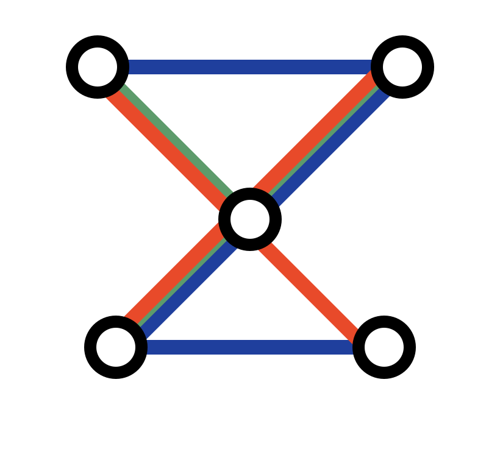

<!-- .slide: class="delta-reference-slide delta-title-slide" data-background-image="assets/delta-campus/delta-reference-01.webp" data-background-size="cover" data-background-color="#050607" -->

  

The Delta Advanced Visitor Experience

---

<!-- .slide: class="delta-reference-slide" data-state="delta-dark-corner-logo" data-background-image="assets/delta-campus/delta-reference-02.webp" data-background-size="cover" data-background-color="#ffffff" -->
Stage One, The 2.5D Web Interface

---

<!-- .slide: class="delta-reference-slide" data-background-image="assets/delta-campus/delta-reference-03.webp" data-background-size="cover" data-background-color="#050607" -->
Visitor Wayfinding, Blue Line Routes Inside The Campus

---

<!-- .slide: class="delta-reference-slide delta-kukan-logo-slide" data-background-image="assets/delta-campus/delta-reference-04.webp" data-background-size="cover" data-background-color="#050607" -->
Guided POIs, The Most Relevant Spaces And Services

---

<!-- .slide: class="delta-video-slide delta-kukan-logo-slide" data-background-video="assets/delta-campus/delta_2k.mp4" data-background-video-loop="true" data-background-video-muted="true" data-background-size="cover" data-background-color="#050607" -->

---

<!-- .slide: class="delta-video-slide" data-background-video="assets/delta-campus/ahoy-screen-take-2-composite.mp4" data-background-video-loop="true" data-background-video-muted="true" data-background-size="cover" data-background-color="#050607" -->
Data Layer, Visitor Analytics And Operational Insight

---

<!-- .slide: class="delta-video-slide" data-background-video="assets/delta-campus/delta-campus-screen-video-2.mp4" data-background-video-loop="true" data-background-video-muted="true" data-background-size="cover" data-background-color="#050607" -->
Delta Campus Screen Concept

---

<!-- .slide: class="delta-video-slide" data-background-video="assets/delta-campus/room-book-video-1.mp4" data-background-video-loop="true" data-background-video-muted="true" data-background-size="cover" data-background-color="#050607" -->
Book Room Screen Concept

---

<!-- .slide: class="delta-reference-slide" data-background-image="assets/delta-campus/delta-reference-07.webp" data-background-size="cover" data-background-color="#050607" -->
Community Networking

---

<!-- .slide: class="delta-reference-slide delta-caption-slide" data-background-image="assets/delta-campus/delta-reference-09-event-inquiries.webp" data-background-size="cover" data-background-color="#050607" -->
Simple Event Enquiries

---

<!-- .slide: class="delta-video-slide" data-background-video="assets/delta-campus/room-book-video-1.mp4" data-background-video-loop="true" data-background-video-muted="true" data-background-size="cover" data-background-color="#050607" -->
Book Room Screen Concept

---

<!-- .slide: class="delta-reference-slide" data-background-color="#050607" -->
Delta Campus Closing Slide

---

<!-- .slide: class="delta-reference-slide" data-background-color="#050607" -->
Delta Campus Blank Slide 12

---

<!-- .slide: class="delta-reference-slide" data-background-color="#050607" -->
Delta Campus Blank Slide 13

---

<!-- .slide: class="delta-reference-slide delta-report-location-slide" data-background-image="assets/delta-campus/delta-reference-06.webp" data-background-size="cover" data-background-color="#050607" -->
Digital Twin, From Wayfinding To Spatial Understanding
