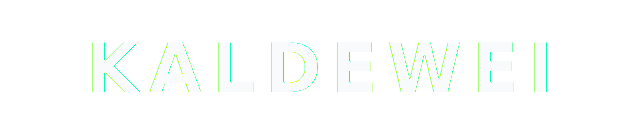

<!-- .slide: class="title-slide proposal-cover kaldewei-cover-slide" data-theme-background="cover" -->

<section class="cover-shell kaldewei-cover-shell">
  

    
    
    
  

  
Lösungsübersicht und Preisindikation

  

  <h1 class="cover-title kaldewei-cover-title">Nachverfolgung von Ladungsträgern für die interne Logistik</h1>
  
Zwei Implementierungsoptionen für rund 3.000 Ladungsträger auf einer gemeinsamen FORMATION-Plattform.

  

    Vorbereitet für KALDEWEI
    |
    19. Januar 2026
    |
    Indikativer Jahrespreis
  

</section>

---
<!-- .slide: class="kaldewei-editorial-slide" data-theme-background="intro" -->
## Zusammenfassung

  

    Entscheidungsrahmen
    <h3 class="kaldewei-mega-statement">KALDEWEI hat eine klare Wahl zwischen einem schnelleren QR-Modell mit geringer Komplexität und einem präziseren, SAP-gekoppelten UWB-Modell.</h3>
    
Beide Optionen nutzen dieselbe FORMATION-Plattform, dasselbe Asset-Modell und identische Check-in- und Check-out-Workflows. Unterschiedlich sind Ortungstechnologie, räumliche Genauigkeit und Integrationstiefe.

  

  

    

      Gemeinsame Basis
      
Eine Plattform, ein Workspace, ein Operator-Workflow für rund 3.000 verfolgte Ladungsträger.

    

    

      Option 1
      
QR-basiertes virtuelles Regalsystem ohne feste Tracking-Infrastruktur und mit geringerer operativer Komplexität.

    

    

      Option 2
      
UWB-gestütztes Scannen mit verpflichtender SAP-Integration für höhere Indoor-Präzision und tiefere Prozessanbindung.

    

  

---
<!-- .slide: class="kaldewei-insight-slide" data-theme-background="platform" -->
## Option 1: QR-basiertes virtuelles Regalsystem

  

    Betriebsmodell
    <strong>Passives Tracking über Scan-Ereignisse</strong>
    
Jeder Ladungsträger erhält einen eindeutigen QR-Code. Die Anwender checken Einheiten mit der mobilen FORMATION-App in logische Lagerpositionen ein und aus.

  

  

    Pro Scan erfasst
    <strong>Identität, Zeit, Nutzer, Geräteposition</strong>
    
Jeder Scan erfasst Asset-Identität, Zeitstempel, Nutzer sowie die GPS-Position des Scangeräts zum Zeitpunkt des Scans.

  

  

    Warum diese Option
    <strong>Schnellster und einfachster Rollout-Pfad</strong>
    
Es ist keine feste Ortungsinfrastruktur nötig. Das Setup funktioniert innen und außen, erlaubt manuelle Korrekturen und erreicht typischerweise 5 bis 10 Meter Genauigkeit.

  

  Indikativer Jahrestotalpreis
  
<strong>36K EUR pro Jahr</strong> bestehend aus passivem Objekt-Tracking für 3.000 Assets, 12 Benutzerlizenzen und dem KALDEWEI-Workspace.

---
<!-- .slide: class="kaldewei-commercial-slide" data-theme-background="support" -->
## Option 2: UWB-Tracking mit SAP-Integration

  

    Systemlogik
    <h3>Gleicher Workflow, tiefere Systemschicht</h3>
    <ul>
      <li>UWB-Tracker sind an Handscannern montiert, nicht an jedem einzelnen Asset.</li>
      <li>Jedes Scan-Ereignis wird um eine präzise Echtzeitposition des Scanners angereichert.</li>
      <li>Scan- und Positionsdaten werden direkt in SAP übertragen.</li>
      <li>Die SAP-Integration ist für diese Option zwingend erforderlich.</li>
    </ul>
  

  

    Operativer Effekt
    <h3>Höhere Präzision für die Intralogistik</h3>
    <ul>
      <li>Zuverlässigere Indoor-Ortung in dichten Lagerumgebungen.</li>
      <li>Weniger Mehrdeutigkeit bei der Lokalisierung von Trägern und Materialbewegungen.</li>
      <li>Direkte Verknüpfung von Scan-Ereignissen mit SAP-Materialprozessen.</li>
      <li>Der Scope ist bewusst optimiert, um unnötige Kostentreiber zu vermeiden.</li>
    </ul>
  

  Indikativer Jahrestotalpreis
  
<strong>48K EUR pro Jahr</strong> bestehend aus aktivem Tracking, SAP-Integration und Support, 12 Benutzerlizenzen sowie dem KALDEWEI-Workspace.

---
<!-- .slide: class="kaldewei-gate-slide" data-theme-background="roadmap" -->
## Preisvergleich

  

    01
    <h3>Option 1</h3>
    
<strong>30K EUR</strong> passives Objekt-Tracking für 3.000 Assets über QR-Scanning.

    
<strong>3K EUR</strong> für 12 Benutzerlizenzen.

    
<strong>3K EUR</strong> für den KALDEWEI-Workspace.

  

  

    02
    <h3>Option 2</h3>
    
<strong>24K EUR</strong> aktives Tracking für 3.000 Assets über Barcode-Scanning.

    
<strong>16K EUR</strong> für SAP-Integration, Setup, laufenden Betrieb, Wartung und Support.

    
<strong>6K EUR</strong> für Lizenzen und Workspace.

  

  

    03
    <h3>Kommerzielle Einordnung</h3>
    
Beide Pfade liegen in einem vergleichbaren jährlichen Kostenrahmen. Die Entscheidung betrifft vor allem Präzision, Integrationstiefe und Rollout-Komplexität.

  

  Preisdifferenz
  
Das präzisere, SAP-gekoppelte Setup liegt um <strong>12K EUR pro Jahr</strong> über der QR-basierten Basisvariante.

---
<!-- .slide: class="kaldewei-gate-slide" data-theme-background="summary" -->
## Preisbedingungen und ROI-Ausblick

  

    A
    <h3>Preisannahmen</h3>
    
Rund 5.000 m² relevante Lagerfläche.

    
Rund 3.000 verfolgte Ladungsträger.

    
12 Nutzer und 3 gemeinsam genutzte Handscanner.

    
Mindestvertragslaufzeit von 3 Jahren.

  

  

    B
    <h3>ROI-Basis</h3>
    
Die Schätzung unterstellt einen annualisierten Produktionswert von rund 200 Mio. EUR und einen Produktivitätseffekt von etwa 1 bis 5 Prozent.

  

  

    C
    <h3>Amortisationssicht</h3>
    
Bei 1 Prozent Produktivitätssteigerung amortisiert sich die Lösung innerhalb weniger Wochen. Bei 3 bis 5 Prozent erfolgt die Amortisation innerhalb weniger Tage.

  

  Kommerzielle Anmerkung
  
Alle Werte sind indikative Jahrespreise und stehen unter dem Vorbehalt der finalen Leistungs- und Umfangsdefinition.

---
<!-- .slide: class="kaldewei-system-slide" data-theme-background="platform" -->
## Implementierungsübersicht

  

    

      
01

      

        <h3>Initiales Setup und Konfiguration</h3>
        
Workspace, Asset-Modell, Nutzerrollen, Scan-Logik und den abgestimmten Prozess-Scope für die gewählte Option aufsetzen.

      

    

    

      
02

      

        <h3>Testbetrieb in begrenztem Bereich</h3>
        
Das System zunächst in einem abgegrenzten Lagersegment betreiben, um Workflows, Datenqualität und Nutzerhandling risikoarm zu validieren.

      

    

    

      
03

      

        <h3>Schrittweiser Rollout in den Vollbetrieb</h3>
        
Nach Stabilisierung des gewählten Setups und Abstimmung der Reihenfolge im Kickoff in den vollen operativen Umfang erweitern.

      

    

  

  

    Rollout-Logik
    <h3 class="kaldewei-side-title">Beide Optionen folgen demselben stufenweisen Implementierungspfad.</h3>
    
Der genaue Zeitplan und die Schrittfolge hängen von der gewählten Option und der finalen Scope-Definition ab. Der Rollout ist bewusst phasenweise angelegt, um früh operativen Wert zu schaffen und Risiken zu kontrollieren.

    

    
Ein verbindliches Angebot kann erstellt werden, sobald die bevorzugte Option und der finale Scope festgelegt sind.

  

---
<!-- .slide: class="kaldewei-close-slide" data-theme-background="closing" -->
## Empfehlung und nächster Schritt

  

    
Das Dokument stellt zwei belastbare Wege dar, um die Nachverfolgung von Ladungsträgern bei KALDEWEI zu digitalisieren, ohne das grundlegende FORMATION-Betriebsmodell zu verändern.

    <h3 class="kaldewei-close-punch">Bevorzugte Option wählen, finalen Scope bestätigen und daraus ein verbindliches Angebot ableiten.</h3>
  

  

    

      Option 1
      
Geringere Komplexität, schnellere Einführung, ausreichend wenn approximative Positionierung operativ genügt.

    

    

      Option 2
      
Höhere Präzision, stärkere SAP-Anbindung, besser geeignet wenn Indoor-Mehrdeutigkeit und Prozesskopplung kritisch sind.

    

    

      Formaler nächster Schritt
      
Ein verbindliches kommerzielles Angebot erstellen, sobald KALDEWEI den bevorzugten Pfad und den finalen Leistungsumfang bestätigt.

    

  

---
<!-- .slide: class="title-slide end-cover kaldewei-cover-slide" data-theme-background="end" -->

<section class="cover-shell kaldewei-cover-shell kaldewei-cover-shell-outro">
  

    
    
    
  

  
Indikatives Angebot für KALDEWEI

  

  <h2 class="cover-end-title">Danke</h2>
</section>
