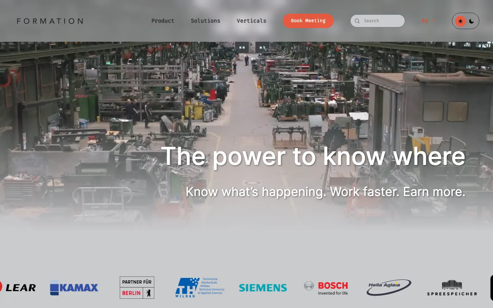

<!-- .slide: class="title-slide proposal-cover hero-video-slide" data-theme-background="cover" -->

<section class="cover-shell">
  

    
    XYZ
  

  
AI Systems For Small Teams

  

  
XYZ by FORMATION

  
How we help smaller teams move faster, look sharper, and operate with capabilities that usually belong to much larger organizations.

  

    XYZ by FORMATION
    |
    Berlin, Germany
    |
    formationxyz.com
  

</section>

---
<!-- .slide: data-theme-background="intro" -->
## What Small Teams Need Most

Small teams rarely need more dashboards or more advice. They need more capacity, less drag, and better systems for turning ideas into shipped work, sharper sales surfaces, and faster decisions.

  

    Outcome 1
    <strong>More capacity</strong>
    
Automate repetitive work, reduce handoff friction, and make the team feel bigger without adding unnecessary overhead.

  

  

    Outcome 2
    <strong>Better commercial output</strong>
    
Turn the website, content, and proof points into a living sales machine instead of a stale brochure.

  

  

    Outcome 3
    <strong>Harder-to-copy products</strong>
    
Use AI, maps, and product thinking to build interfaces and workflows that create real differentiation.

  

<blockquote class="pull-quote">XYZ helps small teams operate like a company twice their size by combining practical AI, specialist operators, and product-grade delivery.</blockquote>

---
<!-- .slide: class="hero-video-slide platform-video-slide" data-theme-background="platform" -->
## How XYZ Supercharges A Team

The model is simple: identify the bottleneck, install the right system or operator, and use the company’s own digital surface as an example of the same thinking in action.

  

    
What We Put In Place

    <h3>Three leverage layers</h3>
    <ul>
      <li>Agentic systems and workflow automation</li>
      <li>Specialist AI operators for website, SEO, and market intelligence</li>
      <li>Spatial and product surfaces for maps, navigation, and harder interface problems</li>
    </ul>
  

  

    
What Changes For The Client

    <h3>Clearer output, less chaos</h3>
    <ul>
      <li>Less status chasing and low-value admin</li>
      <li>More consistent publishing and sharper positioning</li>
      <li>Faster paths from idea to proof, workflow, or customer-facing product surface</li>
    </ul>
  

  

    Install
    <strong>Systems</strong>
  

  

    Retain
    <strong>Operators</strong>
  

  

    Expand
    <strong>Products</strong>
  

---
<!-- .slide: data-theme-background="roadmap" -->
## The Offer Stack

XYZ gives smaller organizations multiple ways to start, depending on whether the immediate need is operational leverage, a sharper website, better market visibility, or a differentiated product direction.

  

    
Agentic Setup

    <h3 class="minor-heading">OpenClaw</h3>
    
Connect tools, workflows, and controls into an agentic operating layer.

  

  

    
Focused Bot

    <h3 class="minor-heading">Nanobot</h3>
    
Wrap one painful workflow with a specialist AI bot that produces usable output fast.

  

  

    
Website Upgrade

    <h3 class="minor-heading">Agentic-Ready Website</h3>
    
Reimagine the site so it becomes more interactive, more useful, and more operationally valuable.

  

  

    
Retained Operator

    <h3 class="minor-heading">Webmaster</h3>
    
Ongoing website updates, SEO-aware iteration, and commercial cleanup without internal drag.

  

  

    
Retained Operator

    <h3 class="minor-heading">SEO Manager</h3>
    
Continuous prioritization and execution around technical SEO, content structure, and search intent.

  

  

    
Retained Operator

    <h3 class="minor-heading">Market Intelligence</h3>
    
Fresh competitor and market signal tracking to help teams sell and decide with more confidence.

  

---
<!-- .slide: data-theme-background="packages-a" -->
## We Use The Same Thinking On Ourselves

The XYZ website is not just marketing collateral. It is proof of the operating model: clear offers, layered proof, content structure, venture surfaces, and multiple paths into the business.

  

    
    

      
Proof Surface

      <h3>Homepage as operating layer</h3>
      
The site packages the whole business clearly: services, maps, venture ideas, FAQs, and conversion paths for real buyers.

    

  

  

    
    

      
Deeper Surface

      <h3>Long-form and proof pages</h3>
      
Longer pages and richer content create a stronger base for search, sales conversations, and category positioning.

    

  

---
<!-- .slide: data-theme-background="packages-b" -->
## Content, Media, And Thought Leadership

A small team gets stronger when expertise is turned into reusable commercial assets: service pages, posts, audio-led thinking, and media that continue selling after the meeting ends.

  

    

      <h3>Long-form thinking</h3>
      Content Engine
    

    
Articles on AI operations, workflow design, and small-team leverage turn internal thinking into discoverable market signal.

    
<a href="https://formationxyz.com" target="_blank" rel="noreferrer noopener">Explore the XYZ publishing surface</a>

  

  

    

      <h3>Audio and podcast-style formats</h3>
      Reusable Proof
    

    
Founder-led media can be reused across sales, hiring, partnerships, and category education instead of disappearing after one conversation.

    
<a href="https://formationxyz.com/#more-posts" target="_blank" rel="noreferrer noopener">Use thought leadership to compound attention</a>

  

  

    

      <h3>Website as sales machine</h3>
      Always On
    

    
The point is not just publishing more. It is building a system where offers, ideas, content, and media work together to bring in the right conversations.

    
<a href="https://formationxyz.com/#get-started" target="_blank" rel="noreferrer noopener">See the conversion path</a>

  

---
<!-- .slide: data-theme-background="support" -->
## AI + Maps Gives XYZ A Harder Edge

Most AI firms stop at prompts and workflow automation. XYZ also brings spatial product depth, which matters for maps, navigation, asset tracking, and physical-world interfaces.

  

    
What This Unlocks

    <ul>
      <li>Maps plus chat interfaces for clearer answers around places and movement</li>
      <li>Navigation and venue experiences that help people act in real space</li>
      <li>Operational products for assets, routes, territories, campuses, and environments</li>
      <li>Location-aware interfaces that are more defensible than generic AI wrappers</li>
    </ul>
  

  

    
Why Buyers Care

    <ul>
      <li>Harder-to-copy product capability</li>
      <li>Useful for logistics, operations, industry, campuses, and events</li>
      <li>Bridge between software, interface design, and the real world</li>
      <li>Proof that XYZ can handle more than back-office automation</li>
    </ul>
  

  
  

    
Example Surface

    <h3>Maps are part of the product story</h3>
    
XYZ can pair AI with spatial interfaces so teams deliver tools that help people navigate, search, locate, and decide more effectively.

  

---
<!-- .slide: class="xyz-delta-campus-slide" data-theme-background="summary" -->
## Delta Campus Is Part Of The Story

XYZ is not an abstract internet business. It has a concrete operating base in Berlin, and the map itself becomes another proof surface: where the team is, how to reach it, and how place can be part of the brand.

  

    
  

  

    
Visit Us

    <h3>Delta Campus, Berlin</h3>
    
Find XYZ by FORMATION at Delta Campus in Berlin. The location itself reinforces the company’s proximity to builders, startups, and product work.

    

      
<strong>Address</strong> Donaustrasse 44 12043 Berlin

      
<strong>Website</strong> <a href="https://formationxyz.com" target="_blank" rel="noreferrer noopener">formationxyz.com</a>

      
<strong>Why it matters</strong> Physical presence, credibility, and a map-based proof point in one slide.

    

    <a class="xyz-contact-qr" href="https://formationxyz.com" target="_blank" rel="noreferrer noopener">
      
      Open XYZ
    </a>
  

---
<!-- .slide: data-theme-background="closing" -->
## Why XYZ Is Compelling

XYZ is compelling because it combines several useful things that small teams usually have to source separately: AI systems, operators, content velocity, product thinking, maps, and venture-minded experimentation.

  

    
    European, privacy-aware operating posture
  

  

    
    Secure, modern digital delivery for real business surfaces
  

  

    
    A model built to create leverage, not more internal chaos
  

  

    
What Clients Get

    <ul>
      <li>More capacity without bloating the team</li>
      <li>Sharper content and clearer commercial surfaces</li>
      <li>Faster movement from idea to workflow, service, or product</li>
      <li>A partner that can work across operations, growth, and product</li>
    </ul>
  

  

    
Why The Story Holds Together

    <ul>
      <li>XYZ uses its own business as a working example</li>
      <li>The website, content, and map surfaces are part of the proof</li>
      <li>The offer scales from focused help to bigger builds</li>
      <li>The whole model is designed for ambitious small organizations</li>
    </ul>
  

---
<!-- .slide: class="title-slide proposal-cover end-cover hero-video-slide" data-theme-background="end" -->

<section class="cover-shell">
  

    
    XYZ
  

  
Operate At Lightspeed

  

  <h2 class="cover-end-title">Meet XYZ In Berlin</h2>
  

    Delta Campus, Berlin
    |
    <a href="https://formationxyz.com" target="_blank" rel="noreferrer noopener">formationxyz.com</a>
  

</section>
